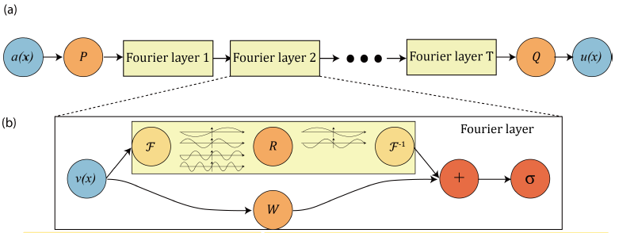
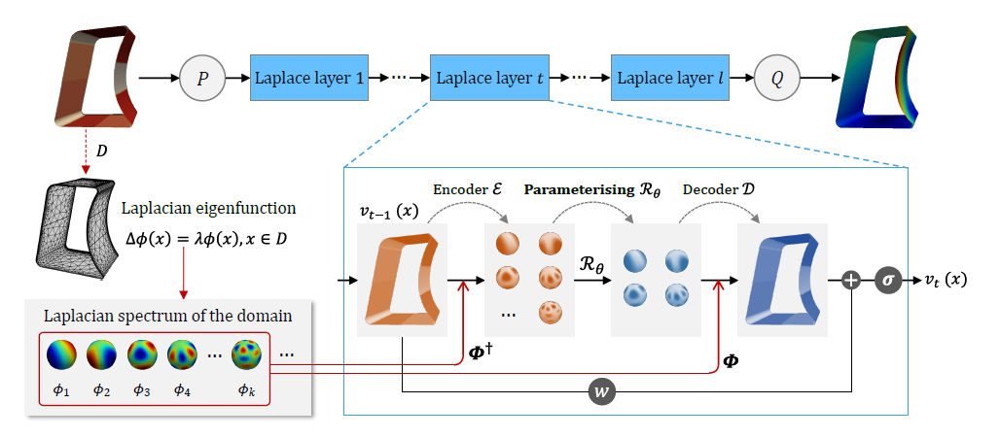
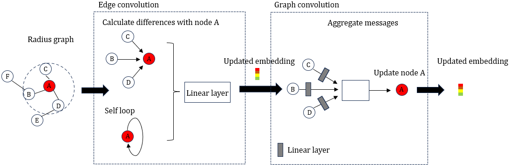
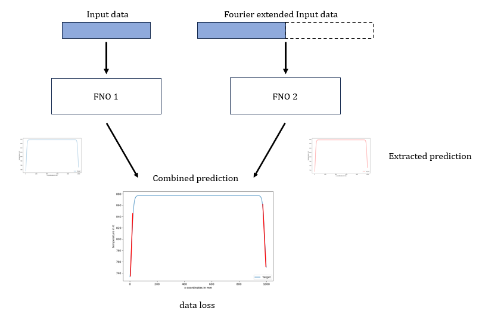
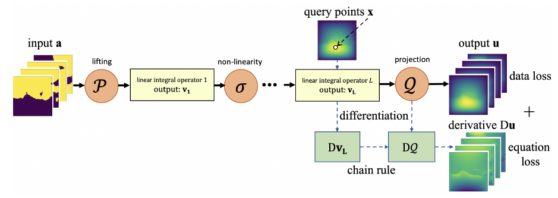
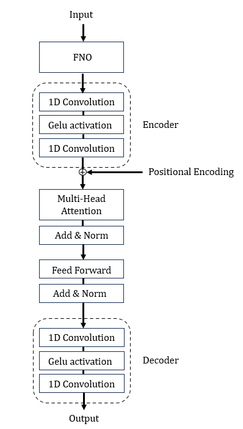
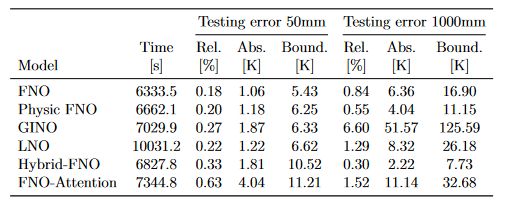
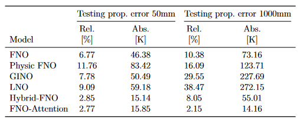

# Data-Driven Solution of the Heat Equation with Transient Boundary Conditions

## Introduction
Modelling Physical behaviour via Neural Networks. This project tries to simulate the heat equation problem with transient boundary conditions with a data driven approach. 

The cooling process of the material glass in an industrial cooling plant is analysed. For optimum cooling behaviour, the cooling temperatures must be set and adjusted on the system. This is done by simulating the process with different starting conditions. This cooling process is described by the heat equation.
The heat equation is a PDE, which is usually solved using numerical methods (FEM, FDM). To solve this equation, it is necessary to specify transient boundary conditions, which are available in dynamic form and can therefore change over time. These computationally intensive and complex numerical simulation methods are to be replaced by methods and models from the field of machine learning. The NO approach offers a very promising starting point here, as it has a high generalisation capability and learns the mapping between infinite dimensional functions. The 1D input data was compiled from three channels, which contain the spatial coordinates, the temperature distribution and the current time stamp. The models are based on the FNO, the LNO or the GINO approach. They are trained on the data of size 50mm and then tested on this size and size 1000mm. The single-step method is selected here, which predicts the output sample of the next time step for one input sample. Overall, the developed Hybrid-FNO performs best on these one-step predictions and shows the best generalisation capability. If only the start temperature is given to a trained model and the model is allowed to predict the next time step based on a prediction, the propagation error is determined. This type of prediction would be optimal for productive applications. The FNO-Attention model performs best here and shows that it can filter the long-term patterns best in the time series data by extending it with the attention mechanism.

## Prerequisites
Before you start, make sure that you have fulfilled the following requirements:
- **Developed on Linux Ubuntu**
- **Cuda 12.1**
- **Anaconda**
- **Pytorch 2.0.1**

## Installation
Carry out the following steps to start the project:

1. **Clone Repo:**
    ```bash
    git clone https://github.com/erlbacsi/Physic_Informed_AI.git
    ```

2. **Install dependencies:**
    ```bash
    conda create --name my_env --file requirements.txt
    ```

## Usage
After installation, you can start the project as follows:

1. **Paramterize training framework:**
    Set the trainings parameter via the yml-file in the directory __"Physic_Informed_AI/Resources/train_FNO.yml"__

2. **Set data paths:**
    Set the data path via the yml-file mentioned before. Every python model architecture file contains a section "data preperation". Here you can set the concrete xlsx-filename and the concrete folder name, with the temperature pictures from the numerical simulation (txt-files). This Repo contains a small example dataset in the __"Physic_Informed_AI/Data/"__ directory.

3. **Start Project:** 
    Choose one architecture file and run it.
    ```bash
    python Thermal_Ai_model_FNO.py
    ```


# Architectures

## Fourier Neural Operator (FNO)


## Laplace Neural Operator (LNO)


## Graph Informed Neural Operator (GINO)


## Hybrid-FNO


## Physic-FNO


## FNO-Attention


# Results and Error propagation
## Results for one-step prediction


## Resluts for propagated prediction
